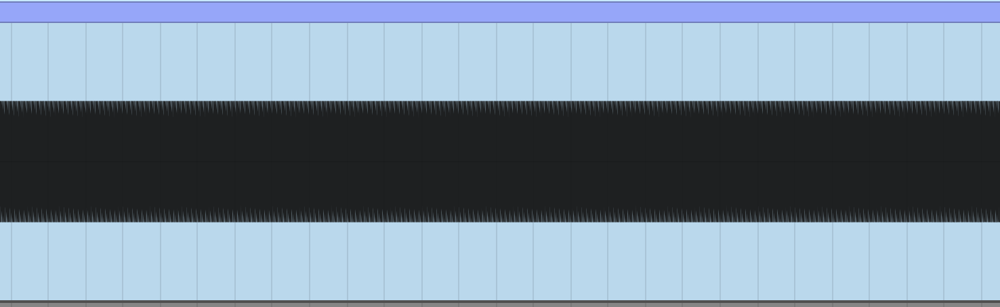

# Negative Space Audio Plugin

An audio plugin that seeks to answer the question: what does the waveform between the left and right waveforms in your DAW sound like.

## History

A few days ago, I saw this tweet from @BASSFACE:

<blockquote class="twitter-tweet">
I am still obsessed with the concept of extracting the hidden waveform in between the real waveform in ableton. <a href="https://t.co/PCKjC3q9IE">pic.twitter.com/PCKjC3q9IE</a>
&mdash; BASSFACE 🫠 (@BASSFACEDUBS) <a href="https://twitter.com/BASSFACEDUBS/status/1616558528118030336?ref_src=twsrc%5Etfw">January 20, 2023</a></blockquote>

If you look a stereo waveform in Ableton (or any other DAW), you'll see the left channel on top and the right channel on the bottom. You'll also notice that the negative space between the two channels looks like another waveform:

 

The question is: what would this waveform sound like? After seeing this tweet, I immediately got to work on a VST plugin. The goal was to see if I couldn't generate that waveform. 

I speculated that all I would need to do is to create a solid "block of sound" and carve into it. The top of the block would get carved by the waveform on the top, and the bottom would get carved by the waveform on the bottom. Sounds pretty simple, right? Unfortunately, there's no such thing as a "block of sound". If you zoom in far enough, you see that what looks solid in Ableton is actually just a bunch of lines made up of side by side points. 

Hmm. Well, each of these points is just a number between -1 and 1. I decided that the closest thing I could imagine to a solid block of sound would be if I were to create a waveform that consisted of a -1, followed by a 1, followed by a -1, etc. Here's what that looks like:

Pretty solid, right? So next I had it carve the top of the block using the top wave form, otherwise known as the left channel of the input signal, and I had it carve the bottom of the block using the bottom signal (right channel). To my surprise, the results sounded like what would happen if you merged both signals and then made them mono. 

When you're zoomed in, you can see that the resulting block of sound is exactly the same shape as the middle between the two lines above.

However, when you zoom out, because of the way Ableton interpolates points, it doesn't look quite right. 

Still, I think this is the closest we'll be able to get to a negative space plugin. We can either get it to look right when zoomed in or when zoomed out, but somehow not both? If anyone has any other ideas for how this could be implemented definitely let me know.

